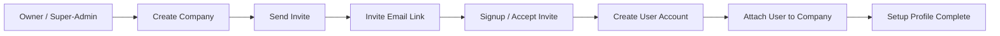

# Company Onboarding Flow

This document explains how company onboarding works in the current app and how the flow is being extended.

## Current State

The app already has an authenticated admin area for managing companies and users.

- Login happens through `app/api/auth/login/route.ts`.
- The JWT includes `companyid`, `roleid`, `role`, and `username`.
- The dashboard shows setup links only for administrators in `app/dashboard/page.tsx`.
- Company CRUD exists in `app/api/companies/route.ts` and `app/companies/page.tsx`.
- User CRUD exists in `app/api/users/route.ts`.

That means the original flow is admin-led provisioning, not self-serve company onboarding.

## Terms Used

- Discovery or signup: a company expresses interest or starts registration.
- Invitation or provisioning: the company is linked to invited users.
- Approval or account setup: the user account is created and tied to the company.
- Configuration or onboarding completion: company defaults and reminder settings are saved.

## Step 1: Company Entry Point

This is the first contact point for the company.

In a SaaS-style flow, this could be:

- a public signup form
- a request-demo form
- an internal admin creating the company manually

In the current app, this is still admin-driven.

## Step 2: Invite Flow

This is the invite-based joining path.

Implemented support:

- `app/api/company-invites/route.ts` creates invite records.
- The API generates a unique token.
- The invite is emailed to the target address.
- The link points to `/signup?invite=TOKEN`.
- Invite records are stored in `company_invites` from `migrations/015_company_onboarding.sql`.

What this means:

- the company admin can invite a user
- the invited user receives a join link
- the app now has the data structure for tracking pending invites

## Step 3: Approval or Account Setup

This is the point where the invited user accepts the invite and finishes account creation.

The current repo has the signup shell at `app/signup/page.tsx`, but it does not yet complete the full accept-invite workflow.

The next implementation should:

- read the invite token from the URL
- verify the invite is valid and not expired
- collect the user password and account details
- create the user under the invited company
- mark the invite as accepted
- redirect into the dashboard

## Step 4: Configuration / Onboarding Completion

This is where the company’s setup profile is saved.

Implemented support:

- `app/api/company-onboarding/route.ts` stores onboarding profile data.
- `company_onboarding_profiles` in `migrations/015_company_onboarding.sql` stores company defaults.

This is the place for:

- company name
- contact email
- contact phone
- reminder defaults
- trial or setup status

## How The Pieces Fit Together

1. An admin or owner creates a company or starts onboarding.
2. The company sends invites to users.
3. Invited users accept the invite and create their accounts.
4. The company setup profile is saved and the company is ready to use.

## What Exists Today

- Admin company management: yes
- Invite record creation: yes
- Invite acceptance flow: not yet complete
- Onboarding profile storage: yes
- Full self-serve company signup: not yet complete

## Relevant Files

- `app/api/auth/login/route.ts`
- `app/api/companies/route.ts`
- `app/api/users/route.ts`
- `app/api/company-invites/route.ts`
- `app/api/company-onboarding/route.ts`
- `app/signup/page.tsx`
- `app/dashboard/page.tsx`
- `migrations/015_company_onboarding.sql`

## Next Build Step

The next code step should be the invite acceptance endpoint and the real signup form submission logic.

## Future Improvements

- Add a contacts-based invite screen so admins can pick from known tenant contacts before sending invites.
- Support a hybrid flow where freeform email entry is still allowed, but the UI warns when the address is not in the tenant contact list.
- Add a confirmation step that shows the exact recipient and company before sending an invite.
